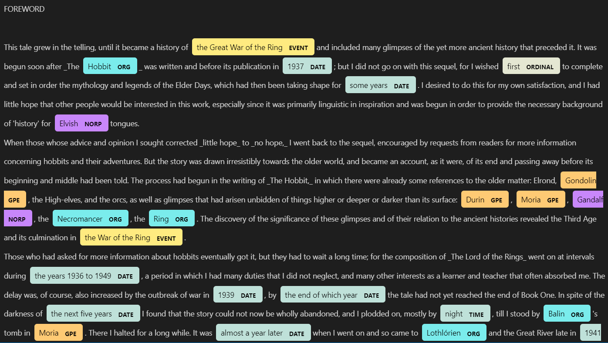
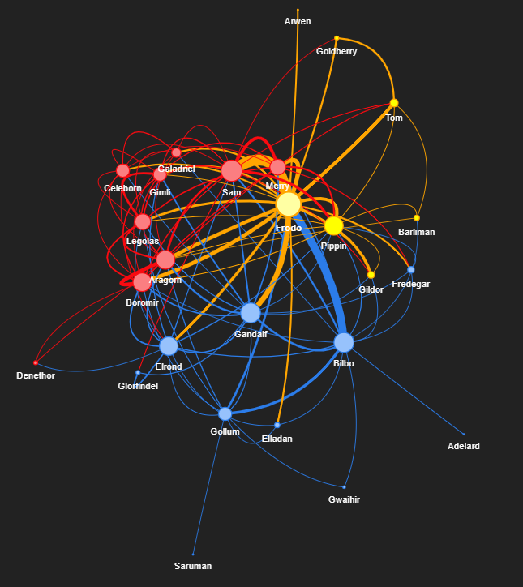
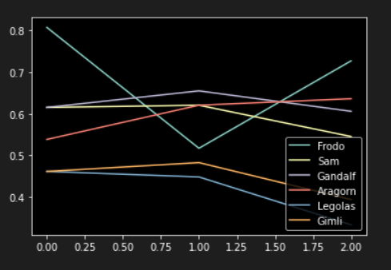

# LOTR Character Relationship Analysis
NLP analysis of interactions and relationships between LOTR books characters.

## Inspiration

Thanks to Thu Vu, and her NLP series that served me as inspiration for this project. [Thu Vu YT channel](https://www.youtube.com/c/Thuvu5)

## Project Stages

This project is mainly divided in 3 stages:

1. Web Scrapping and Character list load.
2. Character's relationships processing.
3. Graph Visualizations.
4. Character's importance along the books timeline.

### 1. Web Scrapping and characters list load

I used Selenium to web scrap LOTR Character's page from [LOTR Fandom](https://lotr.fandom.com/wiki/Category:The_Lord_of_the_Rings_characters).
After some name processing for some characters, I had them stored in a list, built a Pandas DataFrame and load it on a csv.

### 2. Character's relationships processing
First, I displayed a sample of the NER tool of Spacy library:

After that, I mapped Character's conversations in the first book, using a 5-line moving window, stating that if 2 names appear within the window, they are probably talking or interacting with each other. After they were mapped, used agg function sum() to count and sort the most frequent interactions between characters.

### 3. Graph Visualizations.

Once the relationships are mapped, it was time to build the graphs. 
I also calculated and plotted 3 main Centrality Measures:

- Degree Centrality
- Betweenness Centrality
- Closeness centrality

In order to weight the nodes in the graph.

The result is stored in an html interactive file in the Loads folder [lotr_communities](Loads/lotr_communities.html). You can download and open it in your browser. This is a sample of the file:

### 4. Character's importance along the books timeline

Finally, opened all 3 books, repeating the process that I did for the first book, but for the 3 of them. Finally I could visualize the 5 main character's importance along the books.

